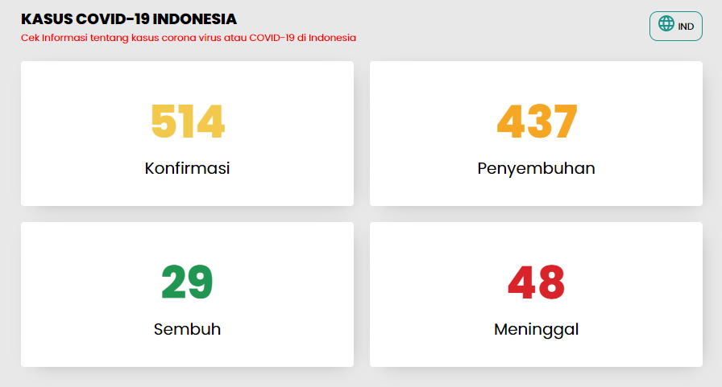
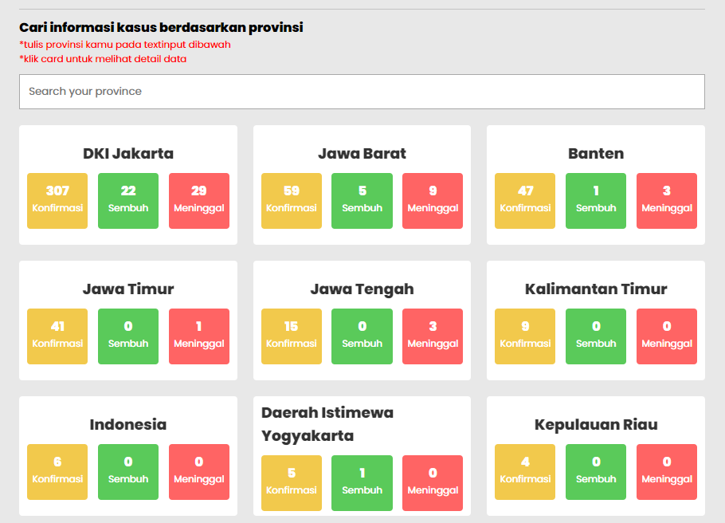
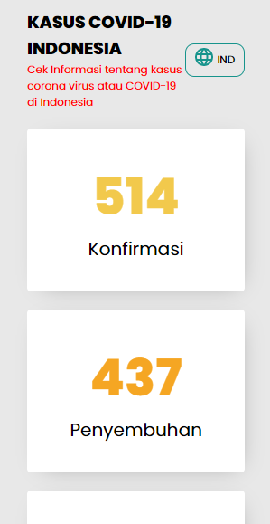
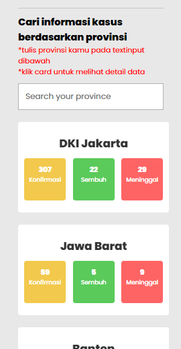
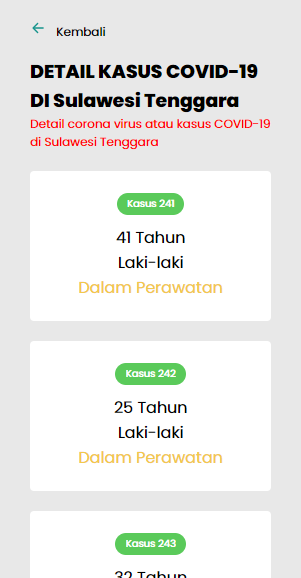

## Indonesia COVID-19 Information

information about corona viruses or COVID-19 in Indonesia 
Data from https://github.com/mathdroid/indonesia-covid-19-api

## `Feature`
- Localization INDONESIA and ENGLISH
- Serach Cases By Province
- Show Detail ( Confirmed, Recovery, Recovered, Death, Age, Gender and Status ) Cases By Province
- Responsive Design

## `Used`
- git clone https://github.com/MochIsrin068/indonesia-covid19-info.git
- npm install
- npm start
  
## `Screen`

### `Desktop : `

### `Mobile : `

